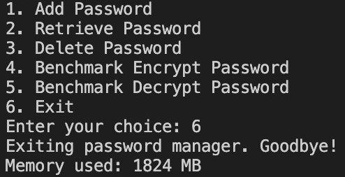

# PassMan

## Problem Statement:

The project aims to address the imperative need for a secure and efficient password manager, incorporating simple encryption and decryption functionalities, concurrency support, and benchmarking capabilities to assess memory usage and runtime. The central focus is on implementing these features using Rust and C++, leveraging their respective strengths in memory safety and performance. The POPL angle in this endeavor emphasizes the strategic choice of Rust for its robust ownership system, enhancing memory safety and reducing the risk of common programming errors. This deliberate selection underscores the project's commitment to creating a secure and reliable password manager while showcasing the practical advantages of Rust in comparison to other programming languages.

## Software Architecture:

### Overview:
The software architecture is modular, comprising multiple folders, each addressing different aspects of our testing and results.

### Components:
- **Single-Language Password Managers:**
   Implements a basic password manager in Rust and C++.

- **Password Managers with Benchmarking:**
   Rust and C++ implementations with benchmarking code for encryption and decryption.

- **Concurrent Password Managers:**
   Rust and C++ implementations with client-server architecture and multithreading support.

- **Simple Encryption/Decryption:**
   Basic encryption and decryption examples in Rust and C++.

### Testing and Database:

The project employs local testing on the developer's machine, focusing on manual input of random values to evaluate the password manager's functionality. While no specific datasets are utilized, the testing process involves diverse scenarios to ensure the robustness of encryption/decryption, concurrency, and overall system behavior.

For database integration, SQLite3 is employed to store encrypted passwords securely. The local testing approach allows for iterative refinement and validation of the password manager's performance on various inputs, contributing to a reliable and effective solution.

### Software Architecture Diagram:

## POPL Aspects:

1. **Ownership and Borrowing:**
   Rust's ownership system is a fundamental aspect that ensures memory safety by tracking the ownership of variables. It prevents data races and null pointer dereferences by enforcing a strict set of rules on how references to data are managed.

   *Comparison with C++:*
   - **C++ Equivalent:**
     While C++ does not have a direct equivalent to Rust's ownership system, it provides manual memory management with pointers and references. However, this manual approach can lead to common pitfalls like memory leaks and undefined behavior.

2. **Concurrency and Thread Safety:**
   Rust encourages safe concurrency through its ownership and borrowing system, ensuring that references to data are accessed in a thread-safe manner. For illustration purposes, Rust's TCPStream crate has been utilized with `read` and `write_all` functions to demonstrate safe data sharing between threads.

   *Comparison with C++:*
   - **C++ Equivalent:**
     C++ also supports multithreading through its `<thread>` library, but ensuring thread safety is left to the developer. The absence of ownership and borrowing concepts in C++ may lead to data races and other concurrency-related issues. In the example, Winsock2 functions have been used in C++ to perform similar operations.

3. **Error Handling:**
   Rust promotes robust error handling which ensures that functions explicitly declare whether they may produce errors and forces the programmer to handle potential errors. Rust's approach of handling errors at compile time makes error handling more explicit and encourages developers to handle errors proactively.

   *Comparison with C++:*
   - **C++ Equivalent:**
     C++ relies on exceptions for error handling, which can lead to less predictable control flow. Rust's approach makes error handling more explicit and encourages developers to handle errors proactively.

4. **Memory Management:**
   Rust's automatic memory management, facilitated by its ownership system, eliminates many common memory-related issues like double-free error, fragmentation, dangling pointers, etc. The ownership system ensures that each piece of data has a single owner, and memory is automatically deallocated when the owner goes out of scope.

   *Comparison with C++:*
   - **C++ Equivalent:**
     In contrast, C++ requires developers to manually allocating and setting bytes in memory using `malloc` and `memset`, which can lead to memory leaks or overwriting memory beyond the intended boundaries.

5. **Functional Programming Features:**
   Rust incorporates functional programming concepts, such as first-class functions and closures, allowing developers to write expressive and concise code.

   *Comparison with C++:*
   - **C++ Equivalent:**
     C++ has introduced functional programming features over time, but Rust's functional programming support is more integral to the language and encourages a functional style of coding.

These POPL aspects highlight Rust's unique features and how they contribute to a safer and more expressive programming experience compared to C++.

## Results

### Rust Password Manager Benchmark

#### Memory Usage

Sampled Average Memory Utilizatoin: 3.48 MB

### C++ Password Manager Benchmark

#### Memory Usage

Sampled Average Memory Utilizatoin: 1824 MB

### Simple Encryption-Decryption Comparison

#### Rust Simple Encryption-Decryption Time

Sampled Average Encryption Time: 8460 ns 
Sampled Average Decryption Time: 3260 ns

#### C++ Simple Encryption-Decryption Time

Sampled Average Encryption Time: 6600 ns 
Sampled Average Decryption Time: 1400 ns

#### Rust Client Creation and Termination Time

Sampled Average Time: 2205320 ns

#### C++ Client Creation and Termination Time

Sampled Average Time: 3465340 ns

### Graphs and Outputs:

#### Cache Results for Benchmarking in C++  

#### Memory Results for Benchmarking in C++  

#### Memory Results for Benchmarking in Rust  

#### Simple Encryption time Rust vs C++  

#### Simple Decryption time Rust vs C++  

#### Client Creation and Termination time Rust vs C++  

### Validation:

#### Memory Security in Rust vs. C++

Memory security is notably better in Rust compared to C++ for several reasons. Rust's ownership system and borrow checker ensure strict control over memory access, preventing common issues like null pointer dereferencing and data races. This enhanced memory safety is crucial for security-sensitive applications, such as password managers, where vulnerabilities can lead to severe consequences.

#### Memory Management Comparison via Benchmark

Benchmarking results consistently demonstrate superior memory management and usage in Rust when compared to C++. Rust's ownership model enables efficient memory allocation and deallocation, minimizing unnecessary overhead and reducing the risk of memory-related vulnerabilities. This advantage is particularly crucial in security-focused applications like password managers.

#### Time Difference for Encryption and Decryption

The time difference for encryption and decryption of a fixed string is comparable between Rust and C++. This similarity can be attributed to the nature of cryptographic operations, where the performance is influenced by algorithmic efficiency rather than language-specific optimizations. While Rust introduces a slight overhead, the observed differences are marginal in scenarios where cryptographic tasks are the primary concern.

#### Time Difference for Client Creation and Immediate Termination

When creating and immediately terminating clients, the time difference is comparable between Rust and C++, with Rust exhibiting a slightly higher execution time. This suggests that the initialization and cleanup procedures, involving less computation and memory-intensive operations, are optimized slightly more effectively in Rust. This phenomenon can be attributed to Rust's emphasis on safety and initialization procedures, introducing a small computational overhead. However, in scenarios involving frequent client initiation and termination, the differences are minimal and may not significantly impact overall performance.

#### Easier Concurrency Implementation in Rust

Concurrency was notably easier to implement in Rust compared to C++ for various reasons. Rust's ownership system and borrowing rules facilitate safe concurrent programming without data races or shared-memory vulnerabilities. Additionally, Rust's ownership model eliminates the need for manual memory management in concurrent scenarios, simplifying code and reducing the likelihood of bugs associated with parallel execution. Moreover, it was easier to implement concurrency in Rust than C++, as Rust gave rise to compilation errors which were easier to debug, while C++ gave rise to runtime errors which required a lot more effort to rectify.

## Potential for Future Work:

- **Enhanced Security Measures:**
   Explore advanced encryption techniques.

- **Cross-Language Compatibility:**
   Improve interoperability between Rust and C++ components.

- **User Interface Enhancement:**
   Develop a user-friendly interface for better accessibility.

- **Further Benchmarking:**
   Conduct extensive benchmarking on various hardware configurations.

## Contributors

- Ankith Praveen (2020B4A70625G)
- Ishaan Kudchadkar (2020B5A70775G)
- Lalita Pulavarti (2020B4A71884G)
- Aditi Kashyap (2020B4A71654G)